# Terraform Static Assets on AWS

Infraestrutura DevOps com S3 privado, CloudFront (OAC), EC2 com IAM Role e Terraform modular.

## Como executar
terraform init
terraform apply

## Arquitetura
CloudFront -> S3 (privado)
EC2 Admin -> S3 (IAM Role)

## Melhorias
- WAF
- ACM + domínio custom
- CI/CD

## 🧩 Diagrama da Arquitetura

```mermaid
graph TD
    User[Usuário / Browser]
    CF[CloudFront CDN]
    S3[S3 Bucket Privado]
    EC2[EC2 Admin<br/>IAM Role]

    User -->|HTTPS| CF
    CF -->|OAC| S3
    EC2 -->|PutObject/GetObject| S3
```

